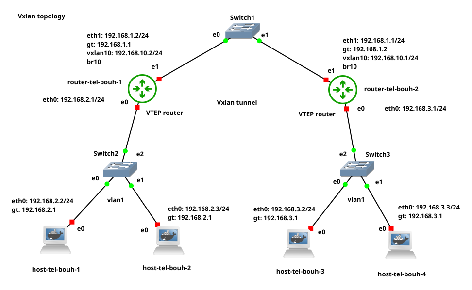
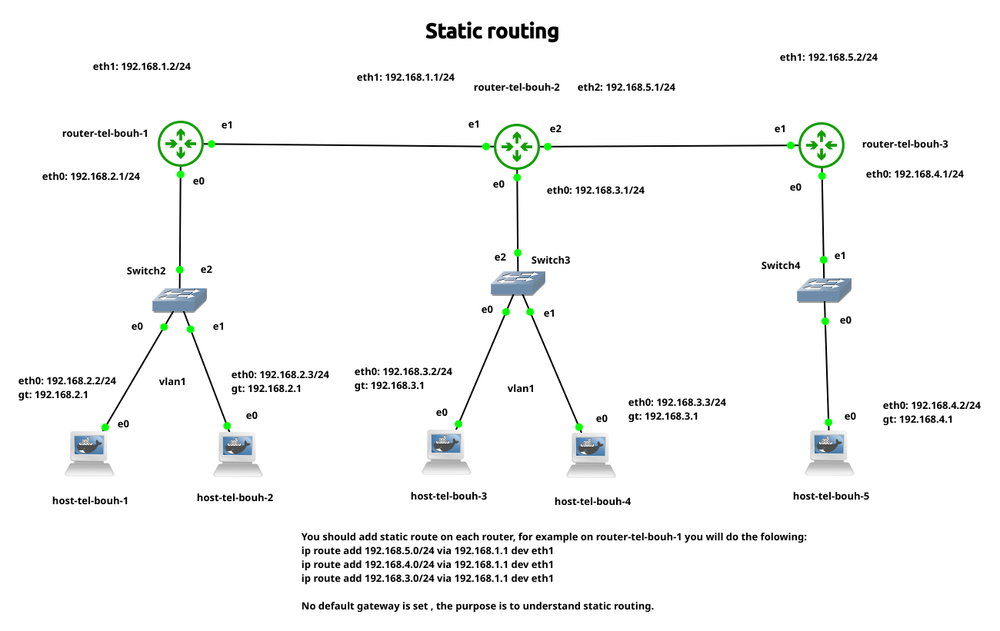

# Overview
The **BGP Project** from the 42 cursus focuses on autonomous systems, where I explore and grasp new concepts in packet forwarding and routing protocols such as **RIP, IS-IS, OSPF, and BGP**.  

The project is divided into three parts:  

### Part 1: Environment Setup  
- Install **Docker** and **GNS3**.  
- Create two Docker images to simulate a **host machine** and a **router device**.  

### Part 2: VXLAN Topology  
- Set up a **VXLAN topology** by creating a **VXLAN tunnel** between two **VTEP routers**.  

### Part 3: BGP with EVPN  
- Discover **BGP (Border Gateway Protocol)** and integrate it with **EVPN (Ethernet VPN)**.  

---

# Part 1: Environment Setup  
In the `p1` folder, you will find installation and uninstallation scripts for both **Docker** and **GNS3**.  
I recommend running the **GNS3 installation commands one by one** in the terminal so you can interact with the GNS3 GUI and configure it as needed.  

**Note**: The installation script I provide is for Linux/Ubuntu OS. You can refer to the official website for instructions on other operating systems.
   -   https://docs.gns3.com/docs/
   -   https://docs.docker.com/engine/install/
   
### Docker Images  
The project includes two **Docker images**:  
1. **Host Image**: Based on `linux/alpine` with pre-installed `busybox`.  
2. **Router Image**: Based on `linux/alpine` with `Quagga` installed and configured.  

### Importing Images into GNS3  
To use these images as **host** and **router**, follow these steps:  

1. **Build both Docker images** using their respective `Dockerfile`.  
2. Open **GNS3 GUI** and navigate to:  
   - **Edit → Preferences → Docker Containers**.  
3. Click **New** :  
   - Select the **host image** you built.  
   - Assign a name to your host.  
   - Set the number of ethernet interface
   - Set "sh" as start command
   - For the **router image** set start command "sh /launch_services.sh"
   - click finish and apply.

# Part 2

   Here you will use docker container to setup you VXLAN topology, i will share with you my topology and the process
of configuation of each device.
  
The Topology:

 If this is your first time using GNS3, you can try those tutorials from GNS3 to get familiar with the workflow.
 
-   https://docs.gns3.com/docs/using-gns3/beginners/the-gns3-gui
-   https://docs.gns3.com/docs/getting-started/your-first-gns3-topology
-   https://docs.gns3.com/docs/getting-started/your-first-cisco-topology

## setup of host and router
   First, we will configure our host and router devices **without** setting up the VXLAN tunnel between routers. Then, we will check connectivity between hosts by pinging their IP addresses. After that, we will set up a VXLAN tunnel between **router-tel-bouh-1 (VTEP1)** and **router-tel-bouh-2 (VTEP2)**.

### Host configuration
   For each host, we will assign an IP address to the Ethernet interface eth0. This can be done in two ways:
   -   Editing the config file – Right-click on the host, select Edit config, and assign the IPs.
    (This method preserves the configuration on Ethernet interfaces even if you close the project and return later.)
   -   Using the command-line interface (CLI) – Right-click on the host and select Console.

   We will use the second approach. However, if you choose the first approach, here is an example of the configuration in the config file. Don't forget to restart the router/host after saving the configuration.
   
   ##### Static config for eth0
	auto eth0
	iface eth0 inet static
	address 192.168.2.2
	netmask 255.255.255.0
	gateway 192.168.2.1
	up echo nameserver 192.168.2.1 > /etc/resolv.conf
   
##### On host-tel-bouh-1 host:
   - ip addr show eth0 : Display eth0 interface
   - ip addr add 192.168.2.2/24 dev eth0 : Set IP address 192.168.2.2 mask 255.255.255.0 to inetface eth0
   - ip route add default via 192.168.2.1 dev eth0 : Set default route (gateway)
   - ip route : Display routes
   
  The same process will be repeated on all host machines. You can use the IPs from the topology or set your own IP subnetting.
  
#### On router device router-tel-bouh-1
   - ip addr add 192.168.2.1/24 dev eth0
   - ip adde add 192.168.1.2/24 dev eth1
   - ip route add default via 192.168.1.1 dev eth1
   
   Again, repeat the same process on the second router.
   
   To check connectivity between hosts, you will need to remove the link between the routers and Switch 1 and instead add a direct link between their eth1 interfaces.
   
   As you know, a switch cannot perform IP routing; it operates at Layer 2 and only works with MAC addresses. We will restore the link after successfully pinging all hosts and validating connectivity.
   
   To check connectivity between hosts, use the ping utility:   **ping IP-Address**
   
   Once you have verified the connection between all hosts, you can reconnect the routers to the switch and proceed with setting up the VXLAN tunnel between Router 1 and Router 2.

If you try to ping host-tel-bouh-4 from host-tel-bouh-1, the request will not reach its destination. Why?
To answer this question, you need to understand how a switch operates. A switch forwards packets based on **MAC addresses** of directly connected devices; it does not perform **IP forwarding**.

When a packet from host-tel-bouh-1 reaches Switch 1, the switch does not know how to forward it to host-tel-bouh-4 because the hosts are in different Layer 2 networks. To allow communication, we create a **VXLAN tunnel** between the two routers.
How VXLAN Works in This Context

VXLAN encapsulates the original packet inside another VXLAN header, which includes a destination IP address (the remote VTEP, or VXLAN Tunnel Endpoint). 
VXLAN encapsulates the original packet inside another VXLAN header, which includes a source IP address (the local VTEP) and a destination IP address (the remote VTEP, or VXLAN Tunnel Endpoint).

To simplify:

-	On router-tel-bouh-1, the VXLAN interface encapsulates the packet by adding its own IP address as the source and the IP address of the VXLAN interface on router-tel-bouh-2 as the destination.
-	When the packet reaches Switch 1, the switch does not understand VXLAN; it simply sees an outer IP packet.
-	The switch will perform an ARP request to find the MAC address corresponding to the destination IP address (the remote VTEP's IP).
-	Once the switch receives an ARP reply, it forwards the encapsulated VXLAN packet based on the outer MAC address.
-	When the packet reaches router-tel-bouh-2, the VXLAN interface decapsulates it, removing the VXLAN header, and the original packet continues its normal route to the destination.

Packet Flow with VXLAN:

-	The packet from host-tel-bouh-1 reaches Router 1.
-	Router 1’s bridge forwards the packet to the VXLAN interface.
-	The VXLAN interface encapsulates the packet, adding an outer MAC header and an IP header (with the remote VTEP’s IP address).
-	The encapsulated packet is then sent via eth1 to Switch 1, which forwards it based on the MAC address.
-	When the packet reaches Router 2, its VXLAN interface decapsulates it, removing the outer headers.
-	The original packet is then forwarded as a normal Layer 2 frame to host-tel-bouh-4.

### Setting up vxlan10 interface and bridge on both routers

**On router-tel-bouh-1**
-	ip link add vxlan10 type vxlan id 10 dev eth1 local 192.168.1.2 remote 192.168.1.1 dstport 4789
-	ip addr add 192.168.10.2/24 dev vxlan10
-	ip link add br10 type bridge
-	ip link set vxlan10 up
-	ip link set br10 up

The same process on **router-tel-bouh-2** with its own IP addresses.

Now you can ping host-tel-bouh-4 from host-tel-bouh-1 to check connectivity

#### Static routing 

Before we dive into VXLAN dynamic multicast, we will first perform a simple lab on static routing and dynamic routing to understand the concepts. Once this is complete, we will proceed with the rest of this section. Below is the topology we will use:

In our router, no default gateway is set. If we try to ping host H1 (host-tel-bouh-1) from host H5 by pinging 192.168.2.2, the packet will be forwarded to the gateway on router R3 (router-tel-bouh-3). When the packet reaches that router, a routing table match will occur, but no match will be found. The packet's network address is 192.168.2.0/24, and the network IP address on interface eth1 is 192.168.5.0/24, so the packet will be dropped by the router.

If a gateway is set on the router as 192.168.5.1, the router will forward the packet to router R2. On router R2, the packet’s network IP address will again be checked against the routing table. If no match is found, the packet will be forwarded to the default gateway. Let’s assume the default gateway is eth1 on router R1. When the packet reaches R1, a match in the routing table will occur, and the packet will be sent to host H1.

However, if the gateway is set to the eth1 interface on router R3, the packet will not reach its destination. In our topology, the gateway can work correctly on R1 and R3 but not on R2. Also, we cannot define more than one gateway on a router. Therefore, in this lab, we will not use a default gateway. Instead, we will configure static routes.

A default gateway tells the router where to forward packets when no match is found in the routing table. Static routes, on the other hand, help to match a packet's network IP address to a specific route. In this lab, we will add static routes on the three routers: R1, R2, and R3.

Now, we will configure static routes on each router in our topology without setting a default gateway.

For router **router-tel-bouh-1**

	ip route # dispay routes
	
 	ip route add 192.168.3.0/24 via 192.168.1.1 dev eth1 # add now route
	
 	ip route add 192.168.5.0/24 via 192.168.1.1 dev eth1
	
 	ip route add 192.168.4.0/24 via 192.168.1.1 dev eth1
	
 	ip route # show now configuration

What we do is simply instruct the router: if you receive an IP address belonging to one of these networks, forward it through the eth1 interface.

For router **router-tel-bouh-2**

	
 	ip route add 192.168.2.0/24 via 192.168.1.2 dev eth1
	
 	ip route add 192.168.4.0/24 via 192.168.5.2 dev eth2

For router **router-tel-bouh-3**

	ip route add 192.168.1.0/24 via 192.168.5.1 dev eth1

	ip route add 192.168.2.0/24 via 192.168.5.1 dev eth1

 	ip route add 192.168.3.0/24 via 192.168.5.1 dev eth1

Now you can ping any hosts to ckeck your configuration.

#### Dynamic routing

Configuring static routes can be a simple task for small topology, but for hunder of routers and hosts it will be a very hard and complex task, to avoid that overhead we will do another lab on dynamic routing setting up **OSPF** on our router, we will make router learn routers dynamically. 

We use the same topology, to remove static routes we just added use the below command:

	
 	ip route del 192.168.3.0/24 dev eth1

To understand how OSPF routing protocol you can make your own research or visit resourse pdf i provide.

I already setting OSPF basic configuration , chek ospf.conf on p1 folder
After deleting static routes lets check our configuration from router console
On console type those commands:

	vtysh

  	show running-config

Then press enter to see the compete configuration.

	router ospf
	 network 192.168.2.0/24 area 0.0.0.0

You will find this basic configuration on all routers, we will change it and set correct networks on each router.

I seggest first type ip route command and see the availible route first then after finish the configuration check the changes happen.

To set new networks type those commands to reach ospf router config level.

 
 	configure terminal
	
 	router ospf

	

for router **router-tel-bouh-1** add those networks

	no network 192.168.2.0/24 area 0 # remove pre-defined network
 	network 192.168.1.0/24 area 0
 	network 192.168.2.0/24 area 0

for router **router-tel-bouh-2** add those networks

	no network 192.168.2.0/24 area 0
	network 192.168.1.0/24 area 0
 	network 192.168.5.0/24 area 0
  	network 192.168.3.0/24 area 0
  	

for router **router-tel-bouh-3** add those networks

	no network 192.168.2.0/24 area 0
	network 192.168.5.0/24 area 0
 	network 192.168.4.0/24 area 0

Our ospf configuration is complete , you can use those command to display you ospf configuration.

	show ip ospf neighbor  # Display OSPF Neighbor Information

 	show ip ospf database  #  Display OSPF Link-State Database LSDB

	show ip ospf           # Display OSPF Configuration

	show ip ospf interface # Display OSPF Interfaces

	show ip route ospf     # Display OSPF Routes

 
 You can exit from vtysh and diplay new added route by ospf by execute **ip route** command.
 You can ping hosts t check coneectivities between them.

