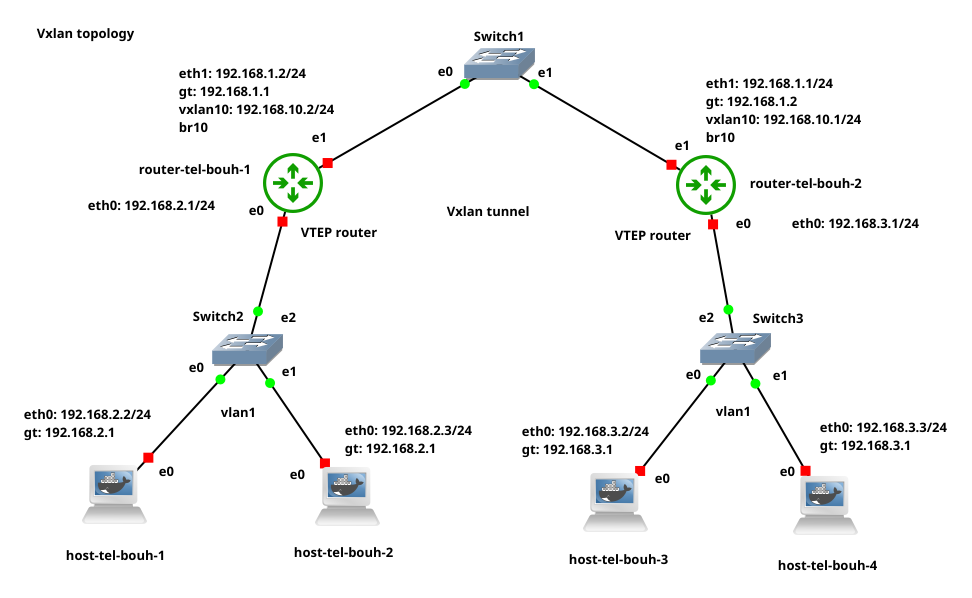

# Overview
The **BGP Project** from the 42 cursus focuses on autonomous systems, where I explore and grasp new concepts in packet forwarding and routing protocols such as **RIP, IS-IS, OSPF, and BGP**.  

The project is divided into three parts:  

### Part 1: Environment Setup  
- Install **Docker** and **GNS3**.  
- Create two Docker images to simulate a **host machine** and a **router device**.  

### Part 2: VXLAN Topology  
- Set up a **VXLAN topology** by creating a **VXLAN tunnel** between two **VTEP routers**.  

### Part 3: BGP with EVPN  
- Discover **BGP (Border Gateway Protocol)** and integrate it with **EVPN (Ethernet VPN)**.  

---

# Part 1: Environment Setup  
In the `p1` folder, you will find installation and uninstallation scripts for both **Docker** and **GNS3**.  
I recommend running the **GNS3 installation commands one by one** in the terminal so you can interact with the GNS3 GUI and configure it as needed.  

**Note**: The installation script I provide is for Linux/Ubuntu OS. You can refer to the official website for instructions on other operating systems.
   -   https://docs.gns3.com/docs/
   -   https://docs.docker.com/engine/install/
   
### Docker Images  
The project includes two **Docker images**:  
1. **Host Image**: Based on `linux/alpine` with pre-installed `busybox`.  
2. **Router Image**: Based on `linux/alpine` with `Quagga` installed and configured.  

### Importing Images into GNS3  
To use these images as **host** and **router**, follow these steps:  

1. **Build both Docker images** using their respective `Dockerfile`.  
2. Open **GNS3 GUI** and navigate to:  
   - **Edit → Preferences → Docker Containers**.  
3. Click **New** :  
   - Select the **host image** you built.  
   - Assign a name to your host.  
   - Set the number of ethernet interface
   - Set "sh" as start command
   - For the **router image** set start command "sh /launch_services.sh"
   - click finish and apply.

# Part 2

   Here you will use docker container to setup you VXLAN topology, i will share with you my topology and the process
of configuation of each device.
  
The Topology:

 If this is your first time using GNS3, you can try those tutorials from GNS3 to get familiar with the workflow.
 
-   https://docs.gns3.com/docs/using-gns3/beginners/the-gns3-gui
-   https://docs.gns3.com/docs/getting-started/your-first-gns3-topology
-   https://docs.gns3.com/docs/getting-started/your-first-cisco-topology

## setup of host and router
   First, we will configure our host and router devices **without** setting up the VXLAN tunnel between routers. Then, we will check connectivity between hosts by pinging their IP addresses. After that, we will set up a VXLAN tunnel between **router-tel-bouh-1 (VTEP1)** and **router-tel-bouh-2 (VTEP2)**.

### Host configuration
   For each host, we will assign an IP address to the Ethernet interface eth0. This can be done in two ways:
   -   Editing the config file – Right-click on the host, select Edit config, and assign the IPs.
    (This method preserves the configuration on Ethernet interfaces even if you close the project and return later.)
   -   Using the command-line interface (CLI) – Right-click on the host and select Console.

   We will use the second approach. However, if you choose the first approach, here is an example of the configuration in the config file. Don't forget to restart the router/host after saving the configuration.
   
   ##### Static config for eth0
	auto eth0
	iface eth0 inet static
	address 192.168.2.2
	netmask 255.255.255.0
	gateway 192.168.2.1
	up echo nameserver 192.168.2.1 > /etc/resolv.conf
   
##### On host-tel-bouh-1 host:
   - ip addr show eth0 : Display eth0 interface
   - ip addr add 192.168.2.2/24 dev eth0 : Set IP address 192.168.2.2 mask 255.255.255.0 to inetface eth0
   - ip route add default via 192.168.2.1 dev eth0 : Set default route (gateway)
   - ip route : Display routes
   
  The same process will be repeated on all host machines. You can use the IPs from the topology or set your own IP subnetting.
  
#### On router device router-tel-bouh-1
   - ip addr add 192.168.2.1/24 dev eth0
   - ip adde add 192.168.1.2/24 dev eth1
   - ip route add default via 192.168.1.1 dev eth1
   
   Again, repeat the same process on the second router.
   
   To check connectivity between hosts, you will need to remove the link between the routers and Switch 1 and instead add a direct link between their eth1 interfaces.
   
   As you know, a switch cannot perform IP routing; it operates at Layer 2 and only works with MAC addresses. We will restore the link after successfully pinging all hosts and validating connectivity.
   
   To check connectivity between hosts, use the ping utility:   **ping IP-Address**
   
   Once you have verified the connection between all hosts, you can reconnect the routers to the switch and proceed with setting up the VXLAN tunnel between Router 1 and Router 2.   
   
   
   

